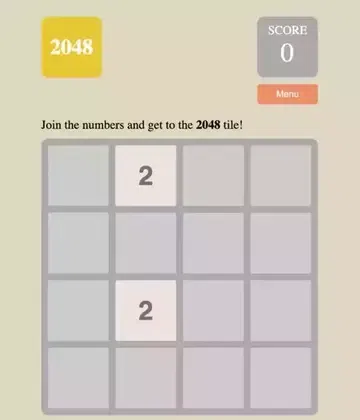

# Introduction

<p align="center">

</p>

Welcome to the 2048 WebComponents Game repository. This is a modern interpretation of the popular 2048 game, leveraging the power of WebComponents for modular, reusable, and encapsulated code. The game also introduces theme change functionality, allowing you to customize the look and feel of your gaming experience.

# Paly it online

Play on [Vercel](https://2048web.vercel.app)

# Run it locally

Before you start, ensure that you have `Node.js` and `pnpm` installed.

Install the required dependencies:

```bash
pnpm install
pnpm dev
```

To start the game, navigate to [localhost:5173](http://localhost:5173/) (or the port indicated in your terminal) in your web browser. Use your arrow keys to move the tiles. Tiles with the same number merge into one when they touch, and the goal is to earn as much score as you can.

You can change the theme of the game using the theme switch provided in the top panel. Choose from a range of pre-set themes to enhance your gaming experience.

# License

This 2048 Game is open-sourced software licensed under the MIT license.
